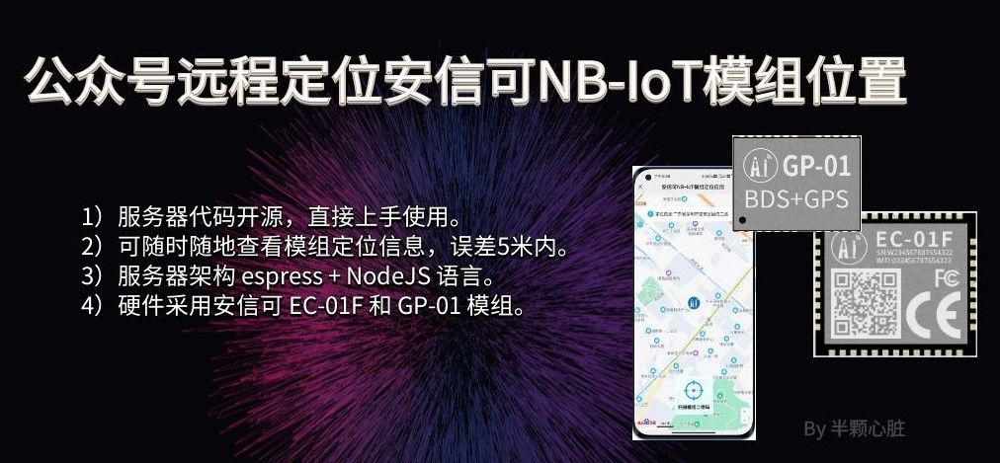

# AiThinkerWechatForNB-IoT

<p align="center">
  
</p>


这是基于安信可NB-IoT模组+GPS模组打造的一个可远程显示定位信息的服务器和微信公众号前端代码，现全面开源奉献物联网。

- [x] 需要自己集成一个MQTT服务器，必须支持 websocket 以及 TCP 协议。
- [x] 集成百度地图开发API SDK等组件：[https://lbsyun.baidu.com/index.php?title=jspopularGL](https://lbsyun.baidu.com/index.php?title=jspopularGL)
- [x] 必须自己搭建一个可远程访问的主机，可以使用阿里云ECS、腾讯云、华为云等远程主机。
- [x] 必须准备一个微信公众号，自行注册：https://mp.weixin.qq.com/

### 一、服务器开始集成

因为此项目是在微信公众号上运行的，所以此服务必须可以远程访问，即部署在远程主机，您可以使用花生壳等工具本地调试。

Step ① ：首先主机环境要安装 NodeJs 和 npm ，参考官方：

```
https://nodejs.org/zh-cn/download/
```

Step ② ：然后，开始安装第三方包：

```
npm init 
npm install
```

Step ③ ：修改公众号配置，设置JS接口安全域名：


Step ④ ：查看开发信息，并设置IP白名单。


Step ⑤ ：代码中修改配置，在 src/config.json 文件里面修改：

```C
{
  "token": "",
  "encodingAESKey": "",
  "accoutId": "填写您的微信公众号ID",
  "appID": "填写您的微信公众号appID",
  "appScrect": "填写您的微信公众号appScrect",
  "myDomain": "http://这里填写您的域名/nb_location"
}
```

Step ⑥ ：代码修改MQTT服务器配置信息，在[src/nb/map_show/index.ejs](https://github.com/xuhongv/AiThinkerWechatForNB-IoT/blob/main/src/nb/map_show/index.ejs#L183)文件修改：

```
    var options = {
        //mqtt客户端的id，这里面应该还可以加上其他参数，具体看官方文档
        clientId: 'mqttjs_' + Math.random().toString(16).substr(2, 8),
        keepalive: 60,
        clean: false
    }
    
    //浏览器采用websocket协议，host主机地址为192.168.0.200，端口为9001，路径为/mqtt
    var client = mqtt.connect("ws://www.your-domain.com:8083/mqtt", options) 
    
```

Step ⑦ ：代码修改您的百度地图应用的 ak，在[src/nb/map_show/index.ejs](https://github.com/xuhongv/AiThinkerWechatForNB-IoT/blob/main/src/nb/map_show/index.ejs#L16)文件修改：

```
<script type="text/javascript"
        src="//api.map.baidu.com/api?type=webgl&v=1.0&ak=6UHwYxs0H4u8SYXUHnIYI1M5UjiqBxzG"></script>
<style type="text/css">
```

Step ⑧ ：开启服务器，指令 node start ，于是出现下面打印，则启动成功。

```
[root@localhost www.aithinker.com]# npm start

> fae.aithinker.com@1.0.0 start www.aithinker.com
> node ./src/app.js

Example app listening at http://localhost:8024
```

--------------------------------------

### 二、开始集成

安信可NB-IoT的EC-01模组-微信公众号定位固件下载：https://docs.ai-thinker.com/nb-iot

安信可NB-IoT模组/开发板EC系列固件更新下载方法：https://aithinker.blog.csdn.net/article/details/120757243

## 讨论交流
<table>
  <tbody>
    <tr >
      <td align="center" valign="middle" style="border-style:none">
       
        <p style="font-size:12px;">QQ群号：434878850</p>
      </td>
      <td align="center" valign="middle" style="border-style:none">
        
        <p style="font-size:12px;">本人微信公众号：徐宏blog</p>
      </td>
      <td align="center" valign="middle" style="border-style:none">
        
        <p style="font-size:12px;">私人工作微信，添加标明来意</p>
      </td>
    </tr>
  </tbody>
</table>

